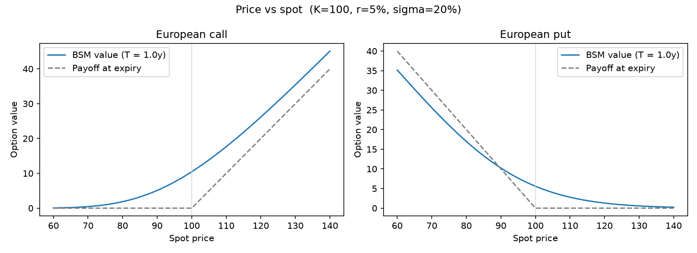
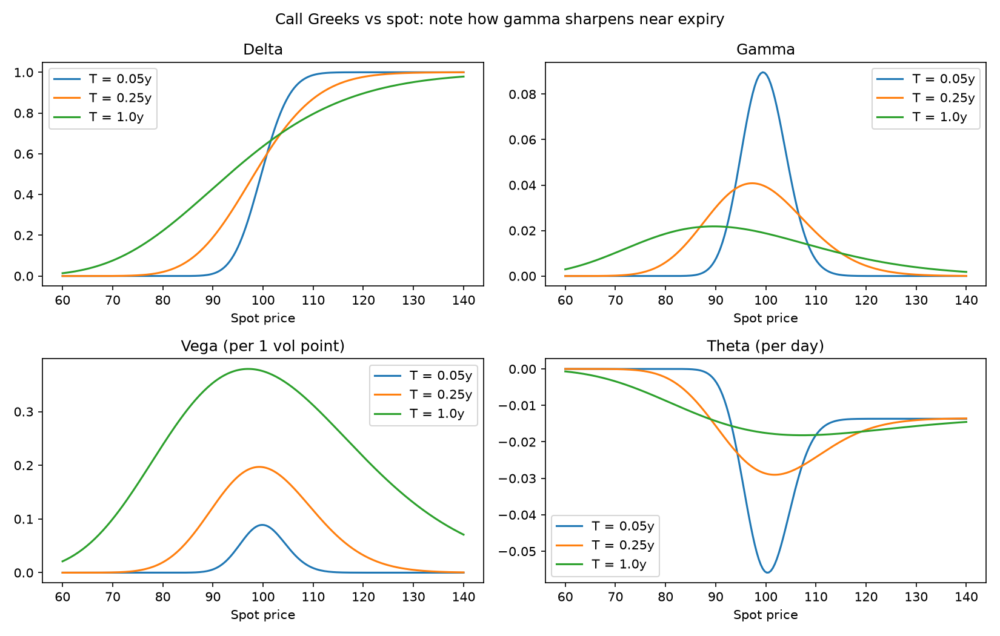
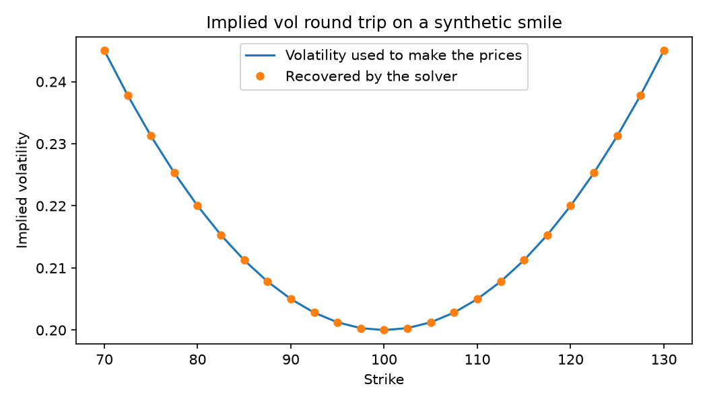

# option-pricing-engine

A small Python library for pricing European options with Black-Scholes-Merton, computing the Greeks in closed form, and backing out implied volatility from a market price.

I'm a maths student at ISI Bengaluru, teaching myself derivatives pricing. Reading about risk-neutral valuation is one thing; getting a number out of code and trusting it is another. This repo is where I'm doing the second part, one piece at a time. The core library uses nothing but Python's standard `math` module, so it's short enough to read in one sitting.

## What it does

- **`bsm_price`** prices European calls and puts, with a continuous dividend yield `q`. At expiry or with zero volatility it falls back to the deterministic payoff instead of dividing by zero.
- **`greeks`** returns delta, gamma, vega, theta and rho in closed form, also with dividends.
- **`implied_vol`** finds the volatility that reproduces a given market price. It rejects prices that break no-arbitrage bounds, since no volatility can produce them.

## Quick start

From the repo root, with `src` on your path:

```python
from optionpricer import bsm_price, greeks, implied_vol

S, K, T, r, sigma = 100, 100, 1.0, 0.05, 0.20   # spot, strike, years, rate, vol

call = bsm_price(S, K, T, r, sigma, "call")      # 10.4506
put  = bsm_price(S, K, T, r, sigma, "put")       # 5.5735

greeks(S, K, T, r, sigma, "call")
# {'delta': 0.6368, 'gamma': 0.0188, 'vega': 37.524, 'theta': -6.414, 'rho': 53.2325}

implied_vol(call, S, K, T, r, "call")            # 0.2  (recovers the volatility we started with)
```

Greeks come back as raw derivatives, not rescaled. Divide vega by 100 for "per vol point", theta by 365 for "per day", and rho by 100 for "per 1% rate move".

## How do I know it's right?

Closed-form Greeks are easy to get subtly wrong: a missing discount factor, a sign error in theta. So I test them against something that doesn't use the same algebra. I bump one input by a tiny amount and watch how the price moves:

$$\Delta \approx \frac{V(S+h) - V(S-h)}{2h}, \qquad \Gamma \approx \frac{V(S+h) - 2V(S) + V(S-h)}{h^2}.$$

If the formula and the numerical estimate agree across a range of strikes, maturities and volatilities, I trust the formula. For the example above, the finite-difference delta matches the closed form to about 10 decimal places. The tests live in `tests/` and run with:

```bash
pip install -r requirements.txt
pytest
```

## Pictures

**Option value against spot.** The curve is the BSM value, and the dashed line is what the option is worth at expiry.



**How the Greeks move with spot, for three expiries.** Gamma sharpens into a spike near the strike as expiry approaches, which is why short-dated at-the-money options are so hard to hedge.



**Implied volatility round trip.** I priced options from a made-up volatility smile, then asked the solver to recover the volatility from those prices. The dots land on the line.



To regenerate the figures (needs `numpy` and `matplotlib`):

```bash
python scripts/make_plots.py
```

## A note on the implied vol solver

It uses Newton's method, because vega gives a fast update, but Newton can overshoot when vega is tiny (deep in or out of the money). So I keep a bracket around the answer and fall back to bisection whenever a Newton step would leave it. That makes it much more robust than plain Newton, and still quick when things are well behaved.

## Project layout

```
src/optionpricer/
    bsm.py          Black-Scholes-Merton pricing
    greeks.py       closed-form Greeks
    implied_vol.py  implied volatility solver
tests/              pytest suite, including finite-difference checks
docs/images/        figures used in this README
```

## What it doesn't do (yet)

- European options only, so no early exercise.
- Constant volatility, rate and dividend yield. Real markets have a volatility smile.

## What I'm building next

1. A **Monte Carlo pricer** with antithetic variates, checked against the BSM price, with a plot of the error shrinking like 1/√N as paths increase.
2. A **binomial tree pricer**, to watch it converge to BSM as the number of steps grows.
3. Later: fitting an implied volatility surface to real Nifty option prices.

I'll update this README as each piece lands.

## License

MIT. See [LICENSE](LICENSE).

Feedback is welcome: gudavallisathyatej@gmail.com or [LinkedIn](https://linkedin.com/in/sathyatej1290).
